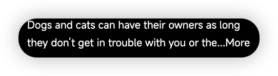
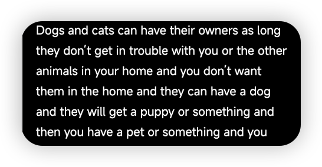

# react-text-ellipsis

## Overview

`react-text-ellipsis` is a React component designed to handle text overflow and ellipsis, similar to the `vue3-vant4-van-text-ellipsis` component. This component provides a simple and effective way to manage long text strings, ensuring that they are displayed neatly without breaking the layout.

## Features

- **Text Overflow Handling**: Automatically truncates text that exceeds the specified length and adds an ellipsis.
- **Customizable**: Easily adjustable properties to fit your design needs.
- **Button Support**: Includes functionality to toggle the full text view, allowing users to expand or collapse the text as needed.

## Installation

To install the component, use npm or yarn:

## Props

### `content` (string)
The text content to be displayed. This is a required prop.

### `onClickAction` (function)
A callback function that is triggered when the action text (e.g., "More" or "Less") is clicked. It receives a `MouseEvent` as an argument.

### `rows` (number, optional)
The number of rows to display before truncating the text. Defaults to `2`.

### `dots` (string, optional)
The string to display at the end of truncated text. Defaults to `'...'`.

### `expandText` (string, optional)
The text to display when the content is collapsed. Defaults to `'More'`.

### `collapseText` (string, optional)
The text to display when the content is expanded. Defaults to an empty string.

## example



## react version text-ellipsis

````
    import TextEllipsis from 'react-text-ellipsis-tool'
    // exiting code
    <TextEllipsis ref={scrollContainer} onClickAction={handleClickAction} content={text} />
````

## like vue3-vant4 van-text-ellipsis

## Usage

Here is a simple example of how to use the `react-text-ellipsis` component in your React application:

## Contributing

We welcome contributions! Please feel free to submit a pull request or open an issue for any suggestions or improvements.

## License

This project is licensed under the MIT License.

## Overview

`react-text-ellipsis` is a React component designed to handle text overflow and ellipsis, similar to the `vue3-vant4-van-text-ellipsis` component. This component provides a simple and effective way to manage long text strings, ensuring that they are displayed neatly without breaking the layout.


# 中文版本

## 概述

`react-text-ellipsis` 是一个 React 组件，旨在处理文本溢出和省略号，类似于 `vue3-vant4-van-text-ellipsis` 组件。这个组件提供了一种简单有效的方式来管理长文本字符串，确保它们整齐地显示而不破坏布局。

## 特性

- **文本溢出处理**: 自动截断超过指定长度的文本并添加省略号。
- **可定制**: 易于调整的属性以适应您的设计需求。
- **按钮支持**: 包含切换完整文本视图的功能，允许用户根据需要展开或折叠文本。

## 安装

要安装该组件，请使用 npm 或 yarn：

## Props

### `content` (string)
要显示的文本内容。这是一个必需的属性。

### `onClickAction` (function)
当点击操作文本（例如“更多”或“更少”）时触发的回调函数。它接收一个 `MouseEvent` 作为参数。

### `rows` (number, optional)
在截断文本之前要显示的行数。默认为 `2`。

### `dots` (string, optional)
在截断文本末尾显示的字符串。默认为 `'...'`。

### `expandText` (string, optional)
当内容被折叠时显示的文本。默认为 `'更多'`。

### `collapseText` (string, optional)
当内容被展开时显示的文本。默认为空字符串。


